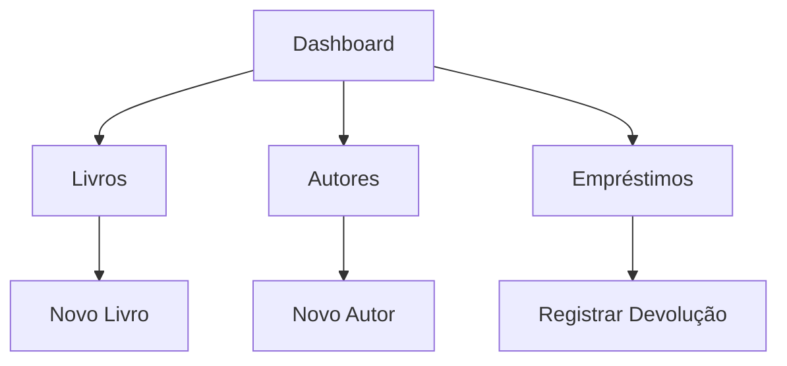

# Stant-oo - Sistema de Gerenciamento de Biblioteca

Sistema completo para gerenciamento de bibliotecas físicas com controle de empréstimos, desenvolvido com Jakarta EE 10 seguindo os padrões MVC e DAO.

# ✨ Funcionalidades

📚 CRUD completo para Autores, Livros, Pessoas e Empréstimos

🔒 Controle de status de livros (Disponível, Emprestado, Atrasado, etc.)

📊 Dashboard com estatísticas

🖥️ Interface web responsiva

# 🛠️ Tecnologias
Backend: Jakarta EE 10 (Servlets, JSP, JSTL)

Frontend: HTML5, CSS3, JavaScript Vanilla

Banco de Dados: MySQL

Servidor: Apache TomEE 8.0+

Dependências:

MySQL Connector/J

Jakarta Servlet API 5.0

Jakarta Server Pages 3.0

Jakarta Expression Language 4.0

# 🏗️ Estrutura do Projeto
text
```bash
biblioteca-web/
├── src/
│   ├── main/
│   │   ├── java/
│   │   │   ├── controller/               # Servlets
│   │   │   │   ├── AutorServlet.java
│   │   │   │   ├── EmprestimoServlet.java
│   │   │   │   ├── LivroServlet.java
│   │   │   │   └── PessoaServlet.java
│   │   │   ├── dao/                     # Camada de dados
│   │   │   │   ├── AdministradorDAO.java
│   │   │   │   ├── AutorDAO.java
│   │   │   │   ├── EmprestimoDAO.java
│   │   │   │   ├── LivroDAO.java
│   │   │   │   └── PessoaDAO.java
│   │   │   ├── model/                   # Entidades
│   │   │   │   ├── Administrador.java
│   │   │   │   ├── Autor.java
│   │   │   │   ├── Emprestimo.java
│   │   │   │   ├── Livro.java
│   │   │   │   └── Pessoa.java
│   │   │   └── util/                    # Utilitários
│   │   │       ├── ConexaoBD.java
│   │   │       └── Criptografia.java
│   │   └── webapp/                      # Frontend
│   │       ├── WEB-INF/
│   │       ├── assets/
│   │       │   └── styles.css           # Estilos
│   │       ├── autores.jsp              # Views
│   │       ├── emprestimos.jsp
│   │       ├── index.jsp
│   │       ├── livros.jsp
│   │       └── pessoas.jsp
│   └── test/                            # Testes
├── target/
├── pom.xml                              # Dependências
└── Libraries/
    ├── mysql-connector-j-9.3.0.jar      # Driver MySQL
    ├── jstl-impl-3.0.1.jar              # JSTL
    └── jstl-api-3.0.0.jar
````
# 📚 Documentação
Rotas Principais
```bash
### 📚 Gestão de Acervo
```http
GET /livros
```
**Descrição**: Lista todos os livros cadastrados  
**Parâmetros**:
- `?status=disponivel` (Filtro por status)

```http
POST /livros
```
**Body**:
```json
{
  "isbn": "123456789",
  "titulo": "Dom Casmurro",
  "autorId": 1,
  "genero": "Literatura"
}
```

### 👥 Gestão de Pessoas
| Rota          | Método | Descrição                     | Parâmetros               |
|---------------|--------|-------------------------------|--------------------------|
| `/pessoas`    | GET    | Lista usuários                | `?nome=valor` (opcional) |
| `/pessoas`    | POST   | Cadastra novo usuário         | JSON no body             |

### 🔄 Empréstimos
```http
GET /emprestimos?status=ativo
```
**Resposta**:
```json
[
  {
    "id": 1,
    "livro": "Dom Casmurro",
    "usuario": "João Silva",
    "dataPrevista": "2023-12-15"
  }
]
```


### Diagrama de Rotas


**Legenda**:
- 🔒 Rotas privadas (requer autenticação)
- 🌍 Rotas públicas
- 📡 Métodos disponíveis: GET, POST, PUT, DELETE
````
````
# 📄 Licença
Este projeto está licenciado sob a Licença MIT - veja o arquivo LICENSE para detalhes.

# ✉️ Contato
Desenvolvedora: Giovanna Teles

LinkedIn: https://www.linkedin.com/in/giovanna-teles-43b947204/
